## 作业调度
### 先来先服务（first-come first-served FCFS）
选择最先进入就绪队列的进程执行，即：按请求CPU的顺序使用CPU。

```mermaid 
gantt
    title timeline
    dateFormat X
    axisFormat %s
    tickinterval day
    section 进程调度
    A: 0,3
    B: 3, 8
    C: 8, 12
    D: 12, 14
    E: 14, 15
```

### 短作业优先（short job first SJF）
根据作业长短计算优先级，作业越短，优先级越高。
SJF具有明显缺点：
- 必须知道作业时间
- 长作业周转时间明显增长。
- 未考虑紧迫作业需求

### 优先级调度算法（priority-scheduling algorithm PSA）
基于作业的紧迫成都，由外部赋予作业优先级，优先保证紧迫性作业执行。

### 高响应比优先调度算法（Highest Response Ratio Next HRRN）
为每个作业引入动态优先级，

$优先权 = \frac{等待时间 + 要求服务时间}{要求服务时间}$

由于等待时间和要求服务时间之和就是作业响应时间，影刺该优先级相当于响应比$R_p$

$R_p = \frac{等待时间 + 要求服务时间}{要求服务时间}= \frac{响应时间}{要求服务时间}$

HRRN的优点是既考虑作业等待时间，也考虑作业运行时间，同时照顾短时作业和长时作业。
缺点是每次调度前需要计算优先级增加开销。

## 进程调度
### 进程调度流程
- 保存处理机现场信息：程序计数器、寄存器内容等。
- 按照算法选取进程。
- 分配CPU。

### 进程调度机制的实现
#### 排队器
事先将所有就绪进程按照一定策略排成一个或多个队列，便于调度。
#### 分派器
根据进程调度程序选定的进程，从就绪队列中取出，进行上下文切换，分配CPU给新进程。
####　上下文切换器
对处理器进行上下文切换时，会发生两对上下文切换：
- OS保存当前进程上下文，装入分派程序上下文，以便分派程序运行。
- 移出分派程序上下文，把新选进程CPU现场信息装入CPU，以便新选进程运行。
上下文切换需要执行大量load和store指令，通常耗费大量时间，不过可以通过类似双重帧缓冲的方式，使用两组寄存器组，使用时切换指针即可。

### 进程调度方式分类
#### 非抢占方式
一旦调度，一直运行，拒绝抢占，直至进程完成或者阻塞。
采用非抢占方式时，可能引起进程调度的原因有：
- 正在执行的进程运行完毕或者因为某事件无法运行。
- 执行进程提出IO请求暂停。
- 进程通信或同步过程中，执行原语操作。
#### 抢占方式
允许调度程序根据某种原则，暂停当前进程，并将已分配的CPU分配给其他进程，防止某一进程长时间占用CPU。
抢占原则：
- 优先权原则：允许优先级高进程抢占当前进程。
- 短进程原则：允许短进程抢占长进程。
- 时间片原则：各进程时间片轮转运行时，时间片用完则停止进程执行并重新调度。

### 轮转调度算法 RR
#### 原理
- 将所有就绪进程按照 FCFS 策略排成就绪队列。
- 周期中断，激活调度程序。
- CPU分配给队首进程，执行一个时间片。
#### 切换时机
- 时间片结束前 进程完成：立即激活调度程序，将进程从就绪队列删除，再调度。
- 时间片结束后 进程未完成：中断处理激活，将进程送入队尾。
#### 时间片大小
时间片大小会对性能产生很大影响，时间片过长，退化为 FCFS，时间片过短，频繁中断和上下文切换增加开销。

### 优先级调度算法
根据紧迫性需求，需要引入优先级。
#### 算法类型
- 抢占式
- 非抢占式
#### 优先级类型
- 静态优先级：根据进程类型、进程需求资源、用户需求 在进程创建时确定。
- 动态优先级：创建时赋予优先级，随进程推进或等待改变。

### 反馈调度法 （Multilevel Queue）
- 设置多个不同优先级队列，每个队列所用时间片不同，依次倍增，优先级越高，时间片越短
- 每个队列采用 FCFS，新进程进入内存会置于第一队列尾。
- 时间片内完成出队；未完成则转入下级队列；重复直至转入第n队列。
